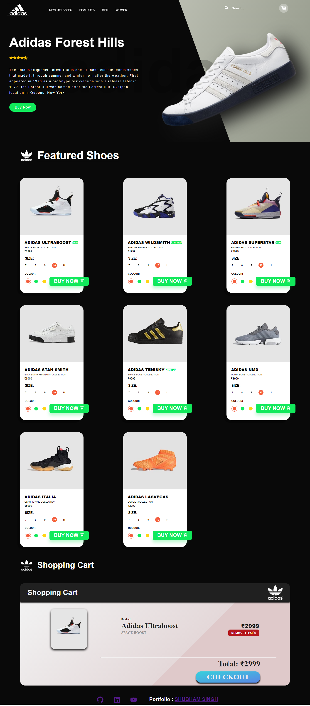
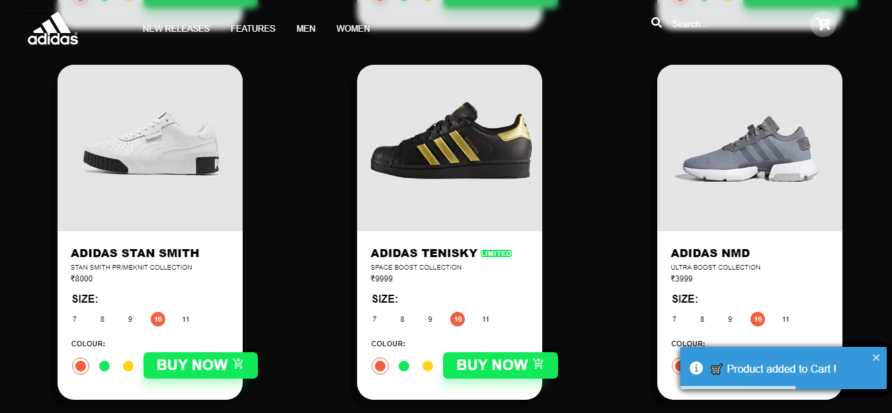

# Shoes Shopping App

## Description

A [**Shoes Shopping App**](https://shoes-js.netlify.app/) is webapp that has features like view products buying Products, adding products to cart. Done with handling APIs and hard-coded JSON object. Built with React, HTML & CSS.

## Links for Project

- ### 📌 [LIVE Project Link](https://shoes-js.netlify.app/)

- ### 📌 [YouTube Link](https://youtu.be/dUnItbkVLQs)

## Tech Stack Used

## Features:

- View product and it's details

- Add product in cart.

- Buy product from Cart ( Though no payment integration is there, thus it empties the cart)

## Installation and Setup Instructions

1. Clone down this repository. You will need `node` and `npm` installed globally on your machine.

2. Installation: `npm install`

3. To Start Server: `npm start`

4. To Visit App: `localhost:3000/`

## Project Screen Shot(s)

## Checkout Portfolio & Other Projects

### ⭐ [Personal Portfolio](https://shubhambhoj.in)

## Connect with Me

- [Mailto](mailto:shubhambhoj3@gmail.com)

- [LinkedIn](https://www.linkedin.com/in/shubham-singh-b122b7171/)

---

[GO TO TOP](#shoes-shopping-app)
